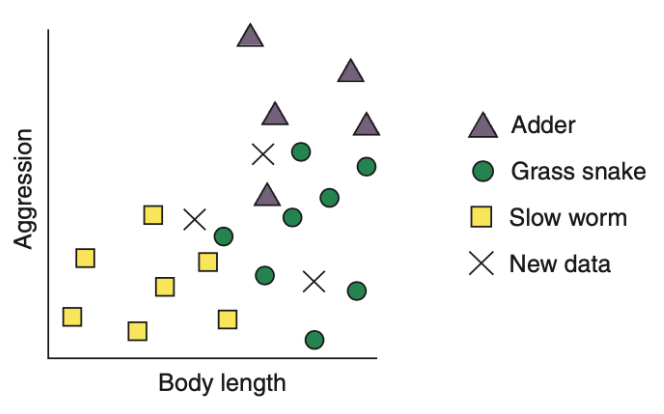
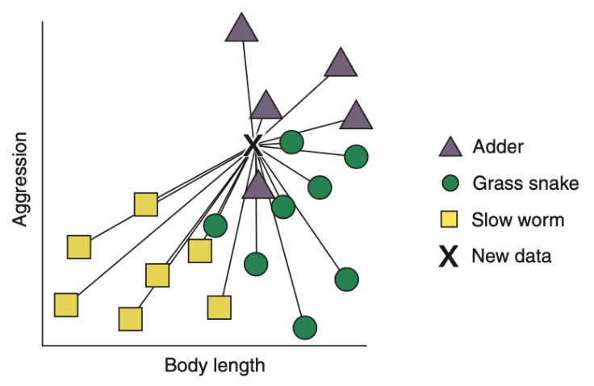
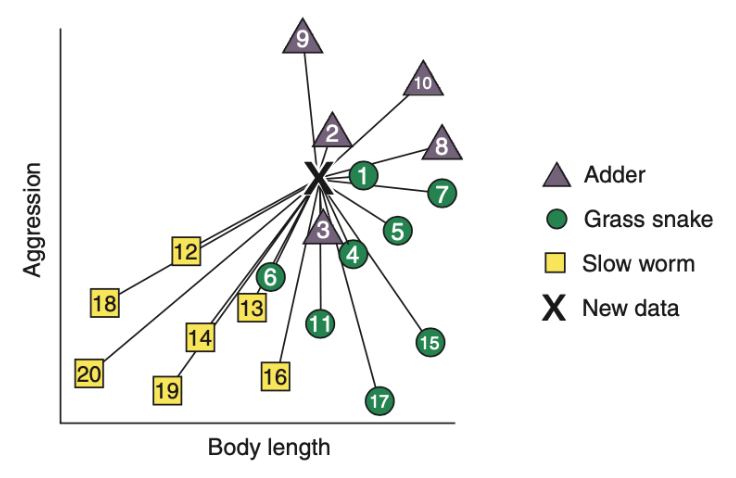
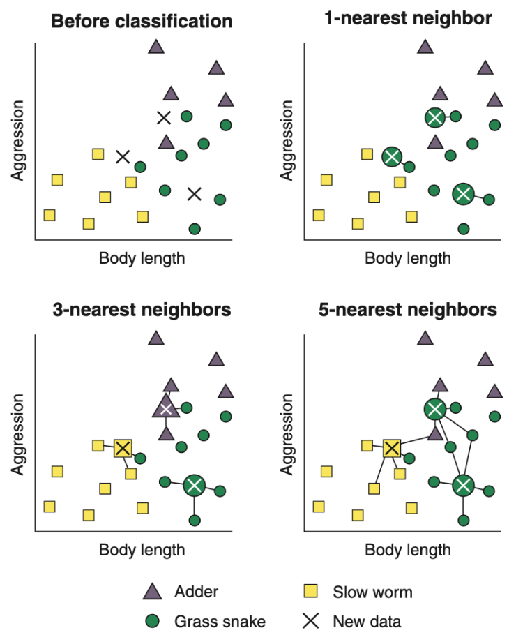
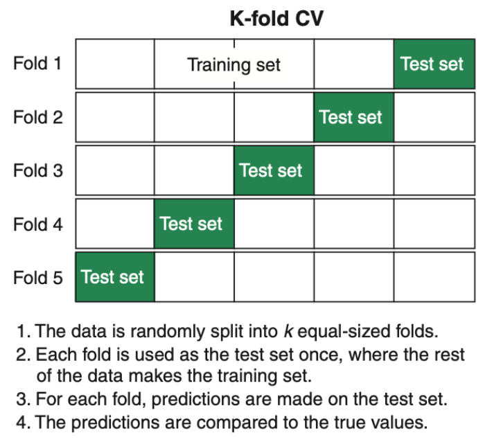

# Problem

You want to understand how the *k*-nearest neighbors (kNN) algorithm works & build your own kNN model.

***

# Stack

I will be using the the R programming language to build the kNN model. The packages I will be using are *tidyverse*, *mlr*, & *mclust*. *tidyverse* is a collection of packages designed for data science, the *mlr* package to build the kNN model & the *mclust* package for our data.

***

# What is the kNN Algorithm?

The kNN algorithm is arguably the simplest classification algorithm. However, don't look down on it because it is simplistic. It can provide excellent classification performance & is simple to interpret.

### How does the kNN Algorithm Learn?

Suppose a reptile conservation project hires you to build a kNN classifier to quickly classify three different species of reptiles: the grass snake, adder, & the slow worm. To build the kNN classifier, you need data. A biologist takes you into the woodlands to find these three reptiles. Upon finding one of them, you record its length & aggression. The biologist manually classifies each of the reptiles so far, but our kNN classifier will classify these reptiles for us in the future.

We plot each of our observations by its body length & aggression, grouped by their species that the biologist helped us classify. We then go back into the woodland & collect three more samples. The below figure demonstrates how the plot might look.

{width=35%}

The kNN algorithm calculates the distance between each new, unclassified case & all of the classified cases. Then for each unclassified case, the algorithm ranks its 'neighbors' from nearest (most similar in terms of body length & aggression) to furthest (least similar in terms of body length & aggression).

{width=40%} {width=40%}

The kNN algorithm finds the *k* classified cases most similar to each new case. *k* is a value that will need to be specified. Each of the *k* classified cases then votes on the class of the new case, based on the classified cases' own class. This means that the the class of the new case will the classification of most of its neighbors. Here's a visualization to aid your understanding.

{width=40%}

If *k* is 1, the algorithm finds the classified case nearest to the new case. Each of the new cases are closest to reptiles classified as a grass snakes, so they would be classified as grass snakes as well. If *k* is 3, the algorithm finds the 3 classified cases nearest to the new case. When a new case has neighbors belonging to more than one class, each neighbor votes for itself & the majority vote wins. If *k* is 5, the algorithm finds the 5 classified cases nearest to the new case; & the new case takes the majority vote of the 5 neighbors. Notice in all of theses scenarios, the value of *k* impacts how the new cases are classified.

### Tied Votes or Equidistant Cases

Now you may be wondering, what happens when the vote is tied? In our previous example, our *k* are odd values, but happens in a situation where our *k* is an even value & there is a tied vote? A common approach is to randomly assign cases with tied votes to one of the classes. In theory, the proportion of cases that have ties will be minuscule & have limited impact on the classification accuracy of our model. However, there are ways to avoid ties altogether such as: 

1. Exclusively selecting odd values of *k* so there cannot be ties
2. Decreasing the value of *k* until a majority vote is won (This will not help if a new case is equidistant to its two nearest neighbors. In such a case, we would randomly assign the new case to a class.)
3. Using a different classification algorithm 

***

```{r, include = FALSE}
library(tidyverse)
library(mlr)
library(mclust)
library(plotly)
library(parallel)
library(parallelMap)
```

# Building a kNN Model

Now that we have an understanding of the kNN algorithm, let's put it to practice. Say you are a biostatistician tasked with a project to improve diagnoses of patients with diabetes. You collect data from suspected diabetes patients & record their diagnoses. This is the dataset you get as a result.

```{r}
dbTib <- as_tibble(diabetes)
head(dbTib)
summary(dbTib)
```

* **class:** diagnosis: *Normal*, *Overt*, or *Chemical*
* **glucose:** area under plasma glucose curve after a 3-hour oral glucose tolerance test (OGTT)
* **insulin:** area under plasma insulin curve after a 3-hour OGTT
* **sspg:** steady state plasma glucose

### Defining a Task

Since we want to build a classification model, we use `makeClassifTask()` to define the classification task. We supply the function with our data `diabetesTib` & the name of the variable that we want to build our model to predict, class.

```{r, warning = FALSE}
dbTask <- makeClassifTask(data = dbTib, target = 'class')
dbTask
```

Calling the task, we can get some information about the number of observations & the number of different variable types. It also indicates whether we have missing data, the number of observations in each class, etc.

### K-Fold Cross-Validation

Before we continue, allow me to explain what a type of cross-validation that is imperative for ML model building. First off, what is cross validation? The whole of a ML model is for its ability to predict on new data. As such, it is horribly inefficient to gather data, build a model from it, & gather data again for our model to predict on. Instead, we split our data in two. We use one portion to train the model & the remaining portion to test the model. This process is called *cross-validation* (CV).

In k-fold CV, we split the data into equal-sized chunks called *folds*, reserving one of the folds for testing & the remaining folds for training. We pass the training set through the model, making records of its performance metrics, repeating with a different fold of the data. continuing until all folds have been used for testing, & getting an average of the performance metric as the estimate of model performance. 

{width=35%}

Say our chosen value of k for k-fold is 10. This means we split the data into 10 equal-sized chunks to perform CV. However, we can repeat this procedure multiple times to get repeated k-fold CSV. To perform repeated k-fold CV in mlr, we make a resampling description, or a set of instructions for how the data will be split into training & testing sets. We supply four arguments to `makeResamplingDesc()`: `method` is the type of cross-validation we want to perform, `folds`, `reps` is the number of repetitions, & `stratify` is whether or not to maintain the proportion of each class of patient in each set.

```{r}
repKFold <- makeResampleDesc(method = 'RepCV', folds = 10, reps = 5,
                          stratify = TRUE)
repKFold
```

### Defining a Learner

A learner tells mlr which algorithm you want to use. Since we want to us the kNN algorithm, we supply `'classif.knn'` as our learner. We also supply `par.vals`, which allows us to specify the value of *k* we want our kNN algorithm to use. We can set *k* to 5 for now.

```{r}
knnLearner <- makeLearner('classif.knn', par.vals = list('k' = 5))
knnLearner
```

### Hyperparameter Tuning

What if instead of specifying our *k* value, we tell the computer to find the value of *k* that will give us the best model prediction accuracy? This process is called hyperparameter tuning & we can perform iwth with the `makeDiscreteParam()` function in mlr. The `makeDiscreteParam()` function allows us to specify the hyperparameter *k* we will tune & the range of values we want to search for the best value of *k*. We nestle this function inside the `makeParamSet()` function, which defines the hyperparameter space we defined from the parameter set, & command mlr to search that parameter space for the best value of *k*. We also cross-validate the tuning process to mitigate against an overfit model.

```{r}
knnParamSpace <- makeParamSet(makeDiscreteParam('k', values = 1:10))
knnParamSpace
gridSearch <- makeTuneControlGrid()
gridSearch
bestK <- tuneParams('classif.knn', task = dbTask, 
                    resampling = repKFold, par.set = knnParamSpace,
                    control = gridSearch)
bestK
```

Our best-performing value for *k* is 7, because it has the lowest mean misclassification error (mmce), but we can visualize the tuning process, define a new learner with our best *k* value, & train a model with that new learner. 

```{r, message = FALSE}
plotHyperParsEffect(generateHyperParsEffectData(bestK),
                    x = 'k', y = 'mmce.test.mean', plot.type = 'line') +
  theme_bw() +
  labs(title = 'Mean Misclassification Error vs. k')
```

### Building the Model & Estimating Model Predictive Accuracy

```{r}
parallelStartSocket(cpus = detectCores() - 1)
newLearner <- setHyperPars(makeLearner('classif.knn'), par.vals = bestK$x)
kNNModel <- train(newLearner, dbTask)

# Estimate of model predictive accuracy
wrapper <- makeTuneWrapper('classif.knn', resampling = repKFold,
                           par.set = knnParamSpace, control = gridSearch)
wrapper
modelEstimates <- resample(wrapper, dbTask, resampling = repKFold)
parallelStop()
modelEstimates
```

Our knn model is estimated to correctly classify over 90% of new cases. 

***

# Using our Model to Make Predictions

Now that we have our model, we collect diagnostics data on 3 new suspected diabetic patients. We can pass the data from these 3 patients & get their predicted diabetic status.

```{r, warning = FALSE}
newPatients <- tibble(glucose = c(83, 107, 299),
                      insulin = c(360, 287, 1051),
                      sspg = c(199, 185, 134))
newPatients
getPredictionResponse(predict(kNNModel, newdata = newPatients))
```

*** 

# Citations/References

Rhys, Hefin I. Machine Learning with R, the Tidyverse, and MLR. Manning Publications, 2020. 